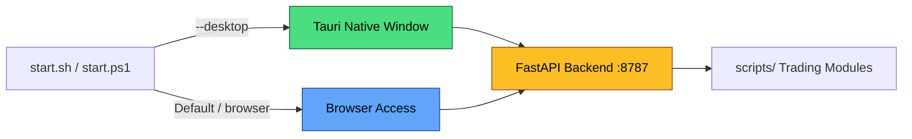
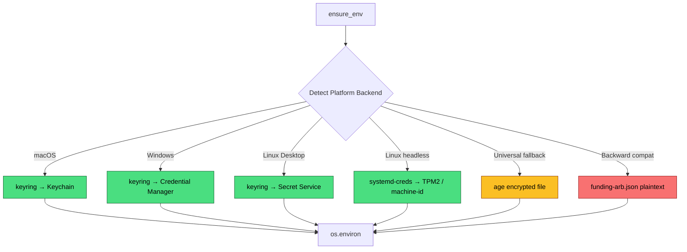

# Funding Rate Arbitrage Engine

Cross-exchange perpetual funding rate arbitrage engine (Cash-and-Carry + Cross-Asset Funding Arbitrage + Pure Futures Spread).

Supports **Bitget / Binance / OKX / Bybit** (spot + USDT-margined perpetuals), splitting spot and futures legs across venues for globally optimal spreads.

## Strategies

| Strategy | Entry Point | Description |
|---|---|---|
| **Cash and Carry (Single Asset)** | `run_cash_and_carry.py` | Single asset spot long + perp short, collecting positive funding. Single hedge leg. |
| **Cross-Asset Arbitrage (Multi Asset)** | `run_cash_and_carry.py` (set `crossAssetArbitrage.maxConcurrentPairs > 1`) | Multi-asset slot contention, only holding the best spread pair. |
| **Reverse C&C** | via `reverse*` parameters | Margin borrow to sell spot + perp long when funding is negative. |
| **Pure Futures Spread** ⭐ | `run_pure_futures_spread.py` / `orchestrate_funding.py --pure-futures` | Perp long on one venue + perp short on another, capturing funding rate differential. No spot/borrow/transfer needed. |

## Quick Start

```bash
git clone <this-repo>
cd funding-arb
bash setup.sh
```

### Visual Dashboard

```bash
# Browser mode (macOS/Linux/Windows, simplest)
bash start.sh              # Auto-build frontend + start server → open http://localhost:8787

# Desktop app mode (requires Rust)
bash start.sh --desktop    # Launch Tauri native window

# Windows
.\start.ps1                # Browser mode
.\start.ps1 -Desktop       # Desktop app mode
```



### CLI Scanning

```bash
# Cash-and-Carry scan
python3 scripts/cli/scan_funding_arbitrage.py --venues bitget,bybit,okx
python3 scripts/cli/scan_unified_funding.py --verbose   # Cross-venue split view

# Pure Futures Spread scan
python3 scripts/cli/scan_pure_futures_spreads.py --verbose
python3 scripts/cli/scan_pure_futures_spreads.py --watch 5  # Continuous monitoring, writes to JSONL
```

### Paper Arbitrage (dry-run)

```bash
# Cash-and-Carry
python3 scripts/execution/run_cash_and_carry.py \
  --config templates/config.cash_and_carry.btc.json --verbose

# Pure Futures Spread
python3 scripts/execution/run_pure_futures_spread.py \
  --config templates/config.pure_futures.spread.json --once --verbose
```

### Live Trading

```bash
# Pure Futures Spread continuous run
python3 scripts/execution/run_pure_futures_spread.py \
  --config templates/config.pure_futures.spread.json --watch 5 --verbose

# Standalone Watcher (persistent monitoring of existing positions)
python3 scripts/execution/pure_futures_watcher.py \
  --config templates/config.pure_futures.spread.json --interval 30 --verbose

# One-click run via orchestrator
python3 scripts/cli/orchestrate_funding.py --pure-futures --run-executor --verbose
```

### Reports & Backtesting

```bash
# Summarize last 24 hours of Pure Futures opportunity quality
python3 scripts/cli/report_pure_futures_spreads.py \
  --jsonl-file data/pure_futures_spreads.jsonl --since-hours 24 --min-samples 3

# Backtesting
python3 scripts/backtest/backtest_pure_futures_spread.py \
  --jsonl-file data/pure_futures_spreads.jsonl --capital 100000 --json

# Manual open/close positions
python3 scripts/cli/pure_futures_trade.py open BTC \
  --long-venue okx --short-venue bybit --trade-usd 500 --dry-run
python3 scripts/cli/pure_futures_trade.py list
python3 scripts/pure_futures_trade.py close <position_id> --dry-run
```

### Cross-Venue Orchestration

```bash
python3 scripts/cli/orchestrate_funding.py --venues bitget,bybit
python3 scripts/cli/orchestrate_funding.py --pure-futures  # Pure perpetuals mode
```

### Testing

```bash
pip install pytest
python3 -m pytest scripts/tests/ -q   # 118 tests, all passing
```

## Configuration

1. Copy `.env.example` → `.env`
2. **Paper** mode requires no API keys (`dry_run: true` is enabled by default)
3. **Live** mode requires filling in the corresponding exchange variables:

| Exchange | Environment Variables |
|--------|----------|
| Bitget | `BITGET_API_KEY`, `BITGET_SECRET_KEY`, `BITGET_PASSPHRASE` |
| Binance | `BINANCE_API_KEY`, `BINANCE_API_SECRET` |
| OKX | `OKX_API_KEY`, `OKX_SECRET_KEY`, `OKX_PASSPHRASE` |
| Bybit | `BYBIT_API_KEY`, `BYBIT_SECRET_KEY` |

API keys need **Spot + USDT-Margined Futures** read/trade permissions enabled; withdrawals must be disabled.

### Credential Management

Run the one-time import tool before first use:

```bash
python3 scripts/cli/setup_credentials.py              # Interactive setup wizard
python3 scripts/cli/setup_credentials.py --check       # View status
python3 scripts/cli/setup_credentials.py --migrate     # Migrate from funding-arb.json
python3 scripts/cli/setup_credentials.py --backend age # Force specific backend
```

The system automatically selects the most secure backend available for the current platform:



| Backend | Platform | Security | Description |
|------|------|:------:|------|
| **keyring** | macOS / Windows / Linux Desktop | ✅ Highest | Keys stored in system keychain, no files on disk |
| **systemd-creds** | Linux headless | ✅ High | Bound to TPM2 or machine-id, undecryptable across machines |
| **age** | All platforms | ⚠️ Medium | Encrypted file, prevents accidental access, not isolated from same-user processes |
| **funding-arb.json** | All platforms | ❌ Low | Plaintext JSON, backward compatibility only |

| Variable | Description |
|------|------|
| `DCA_HOME` | Runtime data root directory (state, journal, backtest output) |
| `DCA_RUNS_NAMESPACE` | Subdirectory name, default `cex-bitget` |
| `DCA_DRY_RUN=1` / `DCA_LIVE=1` | Force paper / live mode |

## Directory Structure

```
funding-arb/
├── templates/              # Strategy config templates
│   ├── config.cash_and_carry.*.json   # C&C config per exchange
│   └── config.pure_futures.spread.json # Pure perp funding spread config
├── scripts/
│   ├── execution/
│   │   ├── run_cash_and_carry.py           # C&C runner
│   │   ├── run_pure_futures_spread.py      # Pure Futures runner
│   │   ├── pure_futures_executor.py        # Pure perp executor (open/close/rollback)
│   │   ├── pure_futures_watcher.py         # Standalone persistent monitoring process
│   │   ├── settle_mismatch_planner.py      # Settlement cycle mismatch analysis
│   │   ├── cross_venue_executor.py         # Cross-venue executor
│   │   └── delta_neutral_executor.py       # Single-venue delta-neutral executor
│   ├── strategies/futures/
│   │   ├── pure_futures_spread.py          # Pure perp decision engine
│   │   ├── cash_and_carry.py               # C&C strategy
│   │   └── cross_asset_arbitrage.py        # Cross-asset strategy
│   ├── backtest/
│   │   ├── unified_funding_pool.py         # Unified funding pool
│   │   ├── backtest_pure_futures_spread.py # Pure perp backtesting
│   │   ├── funding_providers.py            # Funding rate providers
│   │   └── borrow_providers.py             # Borrow providers
│   ├── cli/
│   │   ├── orchestrate_funding.py          # Orchestrator (includes --pure-futures)
│   │   ├── scan_pure_futures_spreads.py    # Pure perp scan CLI
│   │   ├── report_pure_futures_spreads.py  # Persistence report
│   │   ├── pure_futures_trade.py           # Manual trading CLI
│   │   ├── scan_funding_arbitrage.py       # C&C scan CLI
│   │   ├── scan_unified_funding.py         # Cross-venue view CLI
│   │   └── setup_credentials.py            # Credential management tool
│   ├── market/             # funding_batch, price_oracle, parallel_fetch
│   ├── accounting/futures/ # delta_neutral_portfolio
│   ├── venues/             # bitget / binance / okx / bybit
│   ├── core/               # config, notify, credentials
│   └── transfer/           # cross_venue_router, transfer_providers
├── server/                 # FastAPI backend (API + Web UI)
│   ├── main.py            # Entry: API routes + static file serving + WebSocket
│   └── routes/            # scanner, positions, backtest, settings
├── web/                    # Vue 3 + Tauri frontend
│   ├── src/               # Vue source (Scanner, Positions, Backtest, Settings)
│   ├── src-tauri/         # Tauri/Rust desktop shell
│   └── dist/              # Build output (served by FastAPI in browser mode)
├── SKILL.md                # AI agent CLI playbook (this repo only)
├── ROADMAP.md              # Completed work + future direction (Perp DEX, etc.)
├── start.sh                # Unified startup script (macOS/Linux)
├── start.ps1               # Unified startup script (Windows)
└── setup.sh
```

## AI / CLI Skill

For agent-driven workflows without the web UI, see [`SKILL.md`](SKILL.md) at the repo root. In Cursor, use `@SKILL.md` or ask the agent to follow it.

Future work and venue expansion (Perp DEX, etc.): [`ROADMAP.md`](ROADMAP.md).

## Running Tests

```bash
pip install pytest
python3 -m pytest scripts/tests/ -q
# 147+ tests — C&C, Reverse Margin, Pure Futures, Transfer Chain
```

## Origin

This project was independently spun off from [cex-adaptive-dca](https://github.com/counterfactual5/cex-adaptive-dca). See [MIGRATION_FROM_DCA.md](MIGRATION_FROM_DCA.md) for details.

## License

Private repository — all rights reserved unless otherwise noted.
