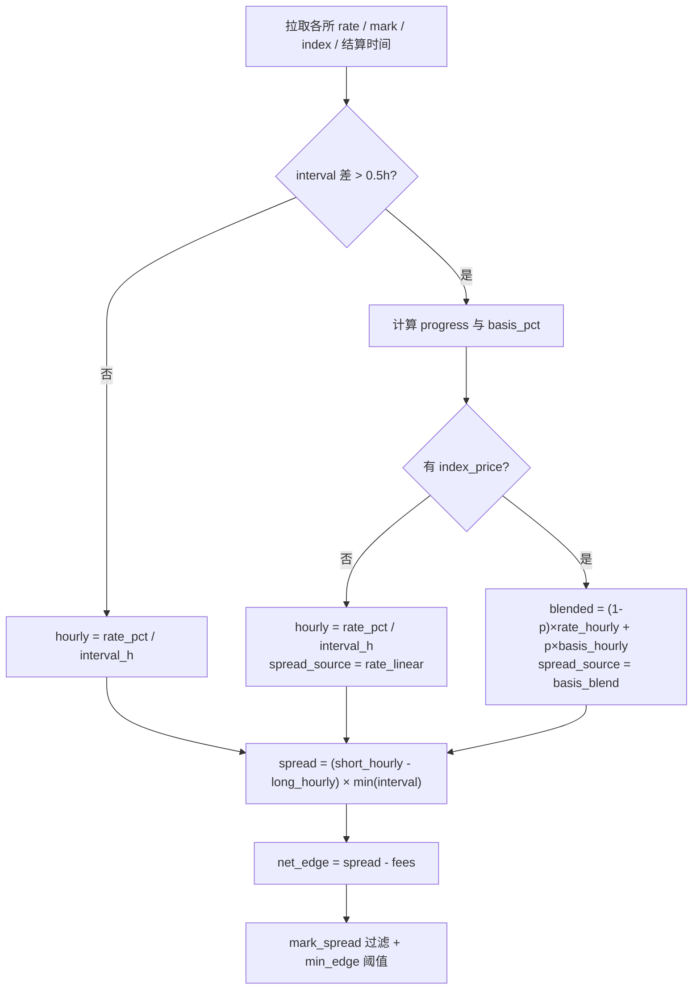

# 跨周期资金费套利模型

本文档描述 **Pure Futures（永续对永续）** 策略中，当两条腿的 **资金费结算周期不同** 时，如何估算可比较的 funding spread 与净边际。

典型场景：Hyperliquid **1h** 结算 vs Binance/OKX **8h** 结算，或 Bitget **2h** vs Binance **8h**。

---

## 1. 问题背景

### 1.1 为什么不能直接比 `rate_pct`？

各交易所公布的 `rate_pct` 是 **当前结算周期内** 的费率，周期长度不同：

| 交易所 | 典型周期 | 含义 |
|--------|----------|------|
| Binance / OKX / Bybit | 8h | 每 8 小时结算一次 |
| Bitget | 2h 或 8h | 部分合约 2h |
| Hyperliquid | 1h | 每小时结算 |

若简单做：

```text
spread_naive = short_rate_pct - long_rate_pct
```

会把 1h 的 0.01% 与 8h 的 0.05% 放在同一量级比较，**严重失真**。

### 1.2 为什么不能只做线性外推？

朴素归一化：

```text
rate_hourly = rate_pct / interval_h
spread = (short_hourly - long_hourly) × min(interval_long, interval_short)
```

在 **周期刚结算完** 时合理（基差已被收敛，`rate_pct` 反映新周期起点）。

但在 **周期中途**，premium（mark 相对 index 的偏离）会持续累积，下一期实际 funding 往往更接近 **基差隐含费率**，而非简单重复上一期公布的 `rate_pct`。跨周期配对时，这一误差会被放大。

### 1.3 本模型的目标

在扫描阶段，对跨周期腿对：

1. 将两边费率统一到 **每小时** 基准；
2. 用 **mark-index 基差** 估计「本周期剩余时间内的预期 funding」；
3. 按 **结算进度** 在「已公布 rate」与「基差隐含 rate」之间加权混合；
4. 输出可解释的字段（`spread_source`、`settle_progress`、`basis_pct`），供前端筛选与风控使用。

---

## 2. 何时启用跨周期模型

```text
is_mismatch = |long_interval_h - short_interval_h| > 0.5
```

- `is_mismatch == false`：**同周期**，直接用 `rate_pct / interval_h`，`spread_source = "rate"`。
- `is_mismatch == true`：启用 **basis blend** 混合模型（有 index 时）或线性回退（无 index 时）。

---

## 3. 数据依赖

每条腿（每个 venue × 每个 base）需要：

| 字段 | 说明 |
|------|------|
| `rate_pct` | 当前待结算资金费率（%） |
| `interval_h` | 结算周期（小时） |
| `mark_price` | 标记价格 |
| `index_price` | 指数 / 预言机价格 |
| `next_funding_ts` | 下次结算时间（ms） |
| `last_settle_ts` | 上次结算时间（ms），可由 `next - interval` 推导 |

### 3.1 各交易所 `index_price` 来源

| 交易所 | 来源 | 跨周期 basis blend |
|--------|------|-------------------|
| Binance | `premiumIndex.indexPrice` | ✅ |
| Bitget | `indexPrice` | ✅ |
| Bybit | `indexPrice` | ✅ |
| OKX | `idxPx`（mark-price 接口） | ✅ |
| Hyperliquid | `oraclePx` | ✅ |
| Aster | 继承 Binance provider | ✅ |
| Lighter | 无公开 index → `0` | ❌ 回退 `rate_linear` |
| EdgeX | 无公开 index → `0` | ❌ 回退 `rate_linear` |

实现位置：

- `scripts/backtest/funding_providers.py` — CEX `fetch_all` / `fetch_current`
- `scripts/venues/hyperliquid_funding.py` — HL `fetch_all` / `fetch_current`
- `scripts/cli/scan_pure_futures_spreads.py` — `fetch_all_fee_rate_rows_by_base()` 组装并回填 `last_settle_ts`

---

## 4. 核心算法

实现模块：**`scripts/core/cross_interval_funding.py`**

### 4.1 结算进度 `progress`

```text
progress = elapsed / period_length   ∈ [0, 1]
```

- `progress ≈ 0`：刚结算完，基差接近 0，**更信任已公布的 `rate_pct`**
- `progress ≈ 1`：即将结算，**更信任 mark-index 基差隐含的下期费率**

计算逻辑（`settle_progress()`）：

1. 若有 `last_settle_ts` 与 `next_funding_ts`：`progress = (now - last) / (next - last)`
2. 若仅有 `next_funding_ts`：用「距下次结算剩余时间」反推进度
3. 皆无：回退 `0.5`

`last_settle_ts` 默认由 `infer_last_settle_ts(next_funding_ts, interval_h)` 推导。

### 4.2 基差 `basis_pct`

```text
basis_pct = (mark_price - index_price) / index_price × 100%
```

并对单周期溢价按 **交易所封顶**（`VENUE_BASIS_CAP_PCT`，见 `cross_interval_funding.py`）：

| 类型 | 单周期 cap | 说明 |
|------|-----------|------|
| Binance / Bybit / Bitget / OKX / Aster / EdgeX | ±0.30% | 约为典型 funding clamp（~0.1%/8h）的 3 倍，过滤极端噪声 |
| Hyperliquid / Lighter | ±0.50% | 无硬顶 EMA premium，放宽 cap |
| 未知 venue | ±0.50% | `DEFAULT_BASIS_CAP_PCT` |

`basis_pct(mark, index, venue=...)` 与 `blended_hourly_rate(..., venue=...)` 按腿传入 venue id。

无有效 `index_price` 时返回 `None`，该腿不参与 basis 混合。

### 4.3 每小时费率估计

**线性（已公布 rate）：**

```text
rate_hourly = rate_pct / interval_h
```

**基差隐含：**

```text
basis_hourly = basis_pct / interval_h
```

**混合（仅 `is_mismatch` 且存在 index）：**

```text
blended_hourly = (1 - progress) × rate_hourly + progress × basis_hourly
```

`progress` 同时作为混合权重 `α`（`blend_alpha`）。

### 4.4 合成 spread 与净边际

对每一对 venue（long 在低 rate 腿，short 在高 rate 腿）：

```text
eff_interval   = min(long_interval_h, short_interval_h)
spread_pct     = (short_blended_hourly - long_blended_hourly) × eff_interval
net_edge_pct   = spread_pct - fee_pct
```

- `fee_pct`：双边开仓 taker 手续费之和（来自 `fee_providers` / VIP 策略）
- `eff_interval` 取较短周期：资金周转由更快结算的那条腿决定

前端 **真实边际**（Scanner UI）：

```text
real_edge_pct = net_edge_pct - mark_spread_pct
```

`mark_spread_pct` 为两所 **标记价** 相对偏差，反映开仓时的价格错配风险（与 funding 模型独立）。

---

## 5. 流程图



---

## 6. 扫描输出字段

`scan_pure_futures_spreads.py` → `_scan_spreads()` 每条机会包含：

| 字段 | 说明 |
|------|------|
| `settle_mismatch` | 是否跨周期 |
| `same_interval` | `not settle_mismatch` |
| `long_interval_h` / `short_interval_h` | 各腿结算周期 |
| `spread_source` | 见下表 |
| `long_basis_pct` / `short_basis_pct` | 各腿 mark-index 溢价（%），无 index 为 `null` |
| `long_settle_progress` / `short_settle_progress` | 各腿混合权重（= progress） |
| `spread_pct` | 混合后的周期 spread（%） |
| `net_edge_pct` | 扣费后净边际（%） |
| `mark_spread_pct` | 两所标记价差（%） |

### `spread_source` 取值

| 值 | 条件 |
|----|------|
| `rate` | 同周期，未启用混合 |
| `basis_blend` | 跨周期，且至少一腿有 index，使用了混合模型 |
| `rate_linear` | 跨周期，但无 index（如 Lighter/EdgeX 腿），仅线性外推 |

---

## 7. 风控与配置叠加

扫描模型之上，还有独立风控层（不替代 basis blend，而是额外收紧）：

### 7.1 `min_edge_mismatch`（策略配置）

在 `server/routes/scanner.py` 的 `_apply_group_thresholds()` 中：

- 同周期且双 1h：可用较低的 `min_edge_1h`
- **`settle_mismatch` 对**：若配置了 `min_edge_mismatch`，要求更高的 `net_edge_pct` 才保留

反映「结算不同步」带来的 timing risk。

### 7.2 `max_mark_spread_pct`

两所 mark 价差超过阈值则丢弃，与 funding 预测无关。

### 7.3 `settle_mismatch_planner`（执行 / 回测）

模块：`scripts/execution/settle_mismatch_planner.py`

- 将两腿 rate **线性归一化到 8h 窗口**
- 分析短周期腿在长周期结算前的 **现金流不对称**（`max_cumulative_outflow_pct`）
- 输出 `adjusted_net_edge_pct`、`capital_buffer_pct`、`viable`

**注意：** 截至本文档编写时，planner 尚未接入 `cross_interval_funding` 的 basis blend；执行层与扫描层的 edge 估算可能不一致。回测 `backtest_pure_futures_spread.py` 对 mismatch 行仍调用 planner 的线性分析。

---

## 8. 代码地图

| 路径 | 职责 |
|------|------|
| `scripts/core/cross_interval_funding.py` | 混合模型纯函数（可单测） |
| `scripts/cli/scan_pure_futures_spreads.py` | 扫描入口，调用混合模型 |
| `scripts/tests/test_cross_interval_funding.py` | 模型单测 |
| `scripts/tests/test_pure_futures_spreads.py` | 扫描集成测试（含 mismatch） |
| `scripts/execution/settle_mismatch_planner.py` | 执行侧现金流 / 8h 归一化分析 |
| `server/routes/scanner.py` | API 缓存、`min_edge_mismatch` 过滤 |
| `web/src/views/Scanner.vue` | 展示 `settle_mismatch`、Cross 筛选、real edge |

---

## 9. 数值示例

**场景：** BTC，Hyperliquid vs Binance，跨周期。

| 腿 | rate_pct | interval_h | basis_pct | progress |
|----|----------|------------|-----------|----------|
| Short @ HL | 0.04 | 1 | +0.30% | 0.85 |
| Long @ Binance | 0.08 | 8 | +0.05% | 0.25 |

**HL 腿：**

```text
rate_hourly  = 0.04 / 1 = 0.04
basis_hourly = 0.30 / 1 = 0.30
blended      = 0.15×0.04 + 0.85×0.30 ≈ 0.261 %/h
```

**Binance 腿：**

```text
rate_hourly  = 0.08 / 8 = 0.01
basis_hourly = 0.05 / 8 = 0.00625
blended      = 0.75×0.01 + 0.25×0.00625 ≈ 0.0094 %/h
```

**Spread（eff_interval = 1h）：**

```text
spread_pct ≈ (0.261 - 0.0094) × 1 ≈ 0.252%
```

若双边手续费合计 0.11%，则 `net_edge_pct ≈ 0.14%`。

若用朴素线性外推（不混合），HL 仅 `0.04%/h`，spread 会 **低估** HL 作为 short 腿的优势。

---

## 10. 已知限制与后续改进

| 项 | 说明 |
|----|------|
| Planner / 回测未统一 | `settle_mismatch_planner`、`unified_funding_pool.best_pure_futures_spread()` 仍用线性 rate/interval |
| 全局 basis 封顶 | 固定 ±1%/周期，未按交易所真实 premium clamp 细分 |
| 无 index 的 DEX | Lighter、EdgeX 跨周期只能 `rate_linear` |
| 历史 JSONL | 旧快照若无 `index_price` / progress 字段，回放无法复现混合模型 |
| 方向与符号 | 混合只调整「预期每小时 funding 大小」；多空方向仍由 raw `rate_pct` 高低决定 |

**建议的下一步：** 让 `settle_mismatch_planner` 与回测共用 `blended_hourly_rate()`，使「扫到的」与「执行的」阈值一致。

---

## 11. 相关测试

```bash
# 模型单测
.venv/bin/python -m pytest scripts/tests/test_cross_interval_funding.py -q

# 扫描集成（含 settle_mismatch）
.venv/bin/python -m pytest scripts/tests/test_pure_futures_spreads.py -q

# Planner
.venv/bin/python -m pytest scripts/tests/test_settle_mismatch_planner.py -q
```

---

## 12. 参考文献（概念）

- 永续合约资金费 ≈ premium（mark 相对 index）向 0 收敛的速度，各所公式不同但结构类似。
- Put-Call / 合成远期与本模型无关；本模型仅用于 **永续对永续 funding rate spread** 的跨周期比较。
