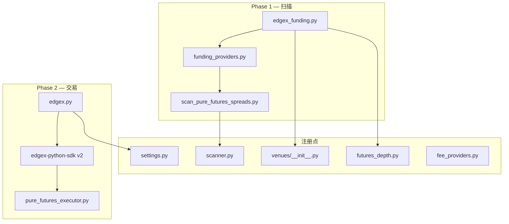

# EdgeX 集成计划

> 状态：**Phase 1 + Phase 2 已实现** — 2026-06-12  
> 参考：Aster / Lighter / Hyperliquid 现有 Perp DEX 接入模式

---

## 0. 实施记录与实测修正（2026-06-12）

Phase 1 已落地，实现中对 plan 做了三处基于实测的修正：

1. **`getTicker` 的 `data` 是单元素 list，不是 dict** —— 取 `data[0]`。
2. **`getDepth` 档位是 `{"price","size"}` 对象**，不是 `[px,qty]` 数组 —— `futures_depth.py` 用专用 parser，不能复用 `_parse_levels`。
3. **`defaultTakerFeeRate` 实测 = `0.00038`（0.038%）** —— 已写入 `fee_providers` / `vip_fee_tiers`，非估值。`last_settle_ts` 可直接取 ticker 的 `fundingTime`，无需推算。

### ⚠️ 关键约束：EdgeX 在 Cloudflare 后且限流极严

实测发现：**EdgeX 无批量 ticker 端点**，资金费率/标记价只能逐合约 `getTicker` 拉取；以 `workers=8` 对 ~292 合约扇出会先触发 **429**，继而触发 **Cloudflare bot challenge（"Just a moment..."），封禁本机 IP 数分钟**。

→ 因此 plan §4.1「并行 getTicker 全量」**不可直接采用**。实现改为：

- **白名单收敛扫描宇宙**：默认 ~30 个主流 base（`EDGEX_SCAN_BASES` 可覆盖）。
- **低并发**：默认 `workers=3`（`EDGEX_SCAN_WORKERS` 可覆盖）。
- **快照缓存 60s**（`_SNAPSHOT_TTL_SEC`）：同一轮扫描多次调用不重复打点。
- `contract_id_for_base` 仍覆盖全部合约（深度检查任意 base 可用），仅扫描宇宙被收敛。

**待 IP 解封后续探**：是否存在批量行情端点（如 `getTicker` 无参 / `getTickerSummary` / WebSocket 快照）。若有，可解除白名单限制。

---

> 以下为原始规划（保留备查）。

---

## 1. 背景与目标

**EdgeX** 是运行在 StarkEx ZK-rollup 上的 CLOB 永续 DEX（Amber 背景），日成交量约 $1.6B，支持 100+ 合约、最高 100x 杠杆。

**集成目标：** 将 EdgeX 纳入 funding-arb 的 **纯永续（pure futures）** 链路：

```
扫描资金费率 → 计算跨所 spread / net edge → 深度检查 → dry-run / 实盘执行
```

**明确排除：** 现金套利（cash-and-carry）与 unified carry——EdgeX 无现货腿，与 HL / Aster / Lighter 相同，仅参与 `scan_pure_futures_spreads`。

---

## 2. API 与 SDK 调研结论

### 2.1 两代 API 并存

| 代际 | Base URL | 签名 | 状态 |
|------|----------|------|------|
| **V1** | `https://pro.edgex.exchange` | StarkEx L2（Pedersen hash） | 生产可用，公开行情丰富 |
| **V2** | `https://edgex-prod-v2.edgex.exchange` | EIP-712 `trading_private_key` | 官方主推，SDK main 分支 |

**官方 SDK：** [edgex-Tech/edgex-python-sdk](https://github.com/edgex-Tech/edgex-python-sdk)

- `edgex-python-sdk <= 0.3.0` → V1 API
- `edgex-python-sdk >= 2.0.0` → V2 API（**新集成应优先 V2 做交易**）

### 2.2 已验证的公开接口（V1，扫描够用）

请求需带 `User-Agent`，否则部分端点返回 **403**。

| 端点 | 用途 |
|------|------|
| `GET /api/v1/public/meta/getMetaData` | 全量合约列表（约 292 个）、`fundingRateIntervalMin`、`defaultTakerFeeRate` |
| `GET /api/v1/public/quote/getTicker?contractId={id}` | `fundingRate`、`markPrice`、`lastPrice`、`nextFundingTime` |
| `GET /api/v1/public/quote/getDepth?contractId={id}&level=15` | 订单簿深度（level 仅支持 15 或 200） |

**BTC 实测示例（contractId `10000001`）：**

- 符号：`BTCUSD`（非 `BTCUSDT`）
- `fundingRate` = `0.00005000`（每期 0.005%）
- `fundingRateIntervalMin` = `240`（**4 小时**结算一期）
- 抵押品 coinId `1000` = `USD`

### 2.3 符号与周期差异

| 项目 | EdgeX | 本项目内部 |
|------|-------|------------|
| 交易对命名 | `BTCUSD` | `BTCUSDT` |
| 合约标识 | 数字 `contractId`（如 `10000001`） | `symbol` 字符串 |
| 默认结算 | 4h（`fundingRateIntervalMin` 因合约而异） | 扫描层用 `interval_h` 归一化 |
| 保证金计价 | USD（稳定币抵押） | 按 USDT 1:1 处理 |

### 2.4 历史资金费率

- `GET /api/v1/public/funding/getFundingRatePage` 在无账户上下文时返回空列表
- **Phase 1** 可只做当前快照扫描；回测历史需在 Phase 1.5 再探公开历史端点或账户 API

---

## 3. 架构对齐

沿用现有 **双适配器** 模式（与 Lighter 最接近）：

```
edgex_funding.py   → FundingProvider（公开 REST，零凭证扫描）
edgex.py           → CexVenue 子集（下单、仓位、余额，依赖 SDK）
```



---

## 4. 分阶段实施

### Phase 1：扫描接入（优先，约 1–2 天）

**交付：** EdgeX 出现在 Scanner / Settings 可选交易所；纯永续扫描可产出 spread 与 net edge。

#### 4.1 新建 `scripts/venues/edgex_funding.py`

实现 `FundingProvider` 接口：

| 方法 | 实现要点 |
|------|----------|
| `fetch_all(quote="USDT")` | `getMetaData` 缓存合约表 → 过滤 `enableTrade` + USD 报价 → 并行 `getTicker` |
| `fetch_current(symbol)` | `contractId` 查 ticker，返回 `rate_pct`、`mark_price`、`next_funding_ts` |
| `fetch_interval_map(quote)` | `fundingRateIntervalMin / 60.0` → `interval_h` |
| `fetch_since(symbol, since_ms)` | 暂返回 `[]` 或后续补历史端点 |

**符号映射：**

```python
# 对外（扫描器内部）
"BTCUSDT"  ←→  EdgeX contractName "BTCUSD" + contractId

def _base_from_symbol(sym: str) -> str:
    s = sym.upper()
    if s.endswith("USDT"):
        return s[:-4]
    if s.endswith("USD"):
        return s[:-3]
    return s

def _symbol_from_base(base: str) -> str:
    return f"{base.upper()}USDT"
```

**费率换算：**

```python
# ticker.fundingRate 为小数（0.00005 = 0.005% / 期）
rate_pct = float(funding_rate) * 100.0
```

**HTTP：** 复用 `venues/http_util.py`，确保默认 `User-Agent`（避免 403）。

#### 4.2 注册与配置（7 处）

| # | 文件 | 改动 |
|---|------|------|
| 1 | `scripts/venues/__init__.py` | `_lazy_load("edgex")`、`_LAZY_VENUES` |
| 2 | `scripts/backtest/funding_providers.py` | `_get_edgex_provider` + `_LAZY_FACTORIES` |
| 3 | `server/routes/scanner.py` | `PURE_ALL_VENUES` 追加 `"edgex"` |
| 4 | `server/routes/settings.py` | `VENUES["edgex"]`，`trade_capable=false`（Phase 1） |
| 5 | `scripts/market/futures_depth.py` | `getDepth` 分支 |
| 6 | `scripts/core/fee_providers.py` | `DEFAULT_TAKER_PCT["edgex"]` |
| 7 | `scripts/core/vip_fee_tiers.py` | `PERP_TIERS["edgex"]`（可从 metadata `defaultTakerFeeRate` 校准） |

前端随 `GET /settings/venues` 动态列表自动出现，**无需**再硬编码（Settings 已改为 API 驱动）。

#### 4.3 测试

新建 `scripts/tests/test_edgex_funding.py`：

- mock `getMetaData` + `getTicker` 响应
- 验证 `BTCUSD` → `BTCUSDT` 映射
- 验证 `rate_pct`、`interval_h=4.0`、`next_funding_ts`
- 验证无 User-Agent 时错误处理（或 http_util 已统一加 UA）

#### 4.4 Phase 1 验收标准

- [ ] `python scripts/cli/scan_pure_futures_spreads.py --venues edgex,binance --json` 有非空输出
- [ ] Web Scanner 勾选 EdgeX 后可触发扫描
- [ ] `GET /api/settings/venues` 含 `edgex`，`scan_capable=true`，`trade_capable=false`
- [ ] 单测通过，CI 无网络依赖

---

### Phase 1.5：历史费率（回测，约 0.5–1 天）

**目标：** `funding_history_source.py` 支持 EdgeX 历史回测。

**待探：**

- 带 `contractId` + 时间范围的公开 funding 历史端点
- 或 V2 SDK `funding` 模块是否提供只读历史
- 若仅私有 API：回测文档标注「需 EdgeX 账户凭证」

**改动：**

- `scripts/backtest/funding_history_source.py`
- `server/routes/backtest.py` venue 说明

---

### Phase 2：实盘 / dry-run 交易（约 3–5 天）

**交付：** `trade_capable=true`，dry-run 与 live 下单走 `pure_futures_executor`。

#### 2.1 新建 `scripts/venues/edgex.py`

参考 `lighter.py` 模式：

| CexVenue 方法 | 实现 |
|---------------|------|
| `get_futures_ticker` | 委托 `EdgexFundingProvider` 或 SDK quote |
| `fetch_futures_symbol_rules` | metadata：`stepSize`、`tickSize`、`minOrderSize` |
| `fetch_futures_positions` | SDK `get_account_positions` |
| `fetch_usdt_account_balances` | SDK `get_account_asset`（USD 余额） |
| `initialize_futures_symbol` | SDK 调杠杆（若有） |
| `execute_trades` | SDK `create_limit_order` / 市价等价；`dry_run=True` 返回 simulated |

**SDK 包装：** `asyncio.run()` 同步包装（同 Lighter）。

**依赖：** `requirements.txt` 增加 `edgex-python-sdk>=2.0.0`（可选 extra 或注释说明）。

#### 2.2 凭证

`scripts/core/credentials.py` + `setup_credentials.py`：

| 环境变量 | 用途 |
|----------|------|
| `EDGEX_ACCOUNT_ID` | 账户 ID |
| `EDGEX_TRADING_PRIVATE_KEY` | V2 EIP-712 交易签名 |
| `EDGEX_BASE_URL` | 可选，默认 `https://edgex-prod-v2.edgex.exchange` |

`server/routes/settings.py`：

```python
"edgex": {
    "name": "EdgeX",
    "type": "dex",
    "prefix": "EDGEX_",
    "required_keys": [],  # 扫描无需 key
    "trade_keys": ["EDGEX_ACCOUNT_ID", "EDGEX_TRADING_PRIVATE_KEY"],
}
```

`venue_trade_capability("edgex")` → 检测 `edgex_sdk` 是否可 import（同 lighter-sdk 模式）。

#### 2.3 深度检查

`futures_depth.py` 已在 Phase 1 实现；executor 开仓前 `check_pair_depth` 自动生效。

DEX 默认 `depthCheckFailOpen: false`——深度拉取失败会阻断开仓。

#### 2.4 Phase 2 验收标准

- [ ] dry-run 开仓写入 positions JSON，`status=open`，`dry_run=true`
- [ ] `live_ready` 在凭证齐全时为 true
- [ ] watcher 能读到 EdgeX 腿仓位与 mark price
- [ ] mock 单测覆盖 `execute_trades` dry-run 路径

---

## 5. 与现有扫描逻辑的交互

### 5.1 跨所 spread 计算

`scan_pure_futures_spreads._scan_spreads` 已支持：

- 不同 `interval_h` 的 hourly 归一化
- 每腿独立 `fee_pct`（费率策略 API / VIP）
- `min_edge_1h` 仅对两腿均为 1h 的 pair 生效——**EdgeX 4h 腿走常规 `min_edge_annual`**

### 5.2 费率来源

Phase 1：走 `vip_fee_tiers.PERP_TIERS["edgex"]` 或 metadata `defaultTakerFeeRate`。

Phase 2：若 EdgeX 提供账户级费率 API，再接入 `fee_providers.resolve_venue_fee`。

### 5.3 不参与的路径

| 模块 | 原因 |
|------|------|
| `scan_funding_arbitrage.py` | 无现货 |
| `unified_funding_pool.py` | 无借币/现货 |
| CEX spot venue 工厂 | Perp-only |

---

## 6. 风险与决策点

| 风险 | 缓解 |
|------|------|
| V1 / V2 API 漂移 | 扫描锁 V1 公开 REST；交易锁 V2 SDK；文档写明版本 |
| 403 封禁 | 统一 User-Agent + 合理并发（`workers=8`） |
| 292 合约全量 ticker 请求量大 | metadata 过滤 `enableTrade`；仅 USDT/USD 报价；可配置 base 白名单 |
| StarkEx V1 签名复杂 | **不做 V1 下单**，仅 V2 交易 |
| 符号 `BTCUSD` vs `BTCUSDT` | 集中在一处 mapping，单测覆盖 |
| 历史费率缺失 | Phase 1 不阻塞；回测标注限制 |

**需产品确认：**

1. Phase 1 是否只扫主流币（BTC/ETH/SOL…）还是全量 292 合约？
2. Phase 2 是否必须同期交付，还是先上线扫描观察 spread 质量？
3. 默认 `scan_venues` 是否包含 `edgex`（建议：**默认不含**，与 aster/lighter 一致，用户手动勾选）

---

## 7. 文件清单（Checklist）

### Phase 1 ✅ 已完成（2026-06-12）

- [x] `scripts/venues/edgex_funding.py`（新建，白名单+低并发+快照缓存）
- [x] `scripts/backtest/funding_providers.py`（`_get_edgex_provider` + `_LAZY_FACTORIES`）
- [x] `scripts/market/futures_depth.py`（`_fetch_edgex_depth`，dict 档位 parser）
- [x] `scripts/core/fee_providers.py`（`edgex: 0.038`）
- [x] `scripts/core/vip_fee_tiers.py`（`PERP_TIERS["edgex"]`）
- [x] `server/routes/scanner.py`（`PURE_ALL_VENUES += edgex`）
- [x] `server/routes/settings.py`（`VENUES["edgex"]` + `venue_trade_capability` 返回 scan-only）
- [x] `scripts/tests/test_edgex_funding.py`（新建，10+ 用例含限流安全契约）
- [x] `ROADMAP.md`（状态更新）
- [ ] `scripts/venues/__init__.py` —— **推迟到 Phase 2**（无 `edgex.py` 交易类前不应注册进 `get_venue`，否则 import 失败）

### Phase 1.5

- [ ] `scripts/backtest/funding_history_source.py`
- [ ] `server/routes/backtest.py`

### Phase 2 ✅ 已完成（2026-06-12）

- [x] `scripts/venues/edgex.py`（新建，V2 SDK，读路径复用 funding provider，dry-run 完整）
- [x] `scripts/venues/__init__.py`（`EdgexVenue` 注册进 `get_venue` + `_LAZY_VENUES`）
- [x] `scripts/core/credentials.py`（`EDGEX_` 前缀 + `EDGEX_ACCOUNT_ID` / `EDGEX_TRADING_PRIVATE_KEY`）
- [x] `server/routes/settings.py`（`venue_trade_capability` 改 `find_spec("edgex_sdk")`，`live_ready` 复用 trade_keys）
- [x] `requirements.txt`（`edgex-python-sdk>=2.0.0` 可选）
- [x] `.env.example`（EdgeX 凭证段）
- [x] `scripts/tests/test_edgex_venue.py`（新建，dry-run + 桩 SDK live 路径 + 持仓/余额解析）

**已用真实 SDK 接口对齐**（edgex-Tech/edgex-python-sdk main）：
`from edgex_sdk import Client, OrderSide`；`Client(base_url, asset_base_url, account_id, trading_private_key)`；
`await create_limit_order(contract_id, size, price, side)` / `get_account_positions()` / `get_account_asset()`。
EdgeX 无市价单原语 → 开/平用激进限价（穿价 2%）模拟 taker，同 Lighter。

**仍需实盘校验**（SDK 未安装、无账户）：
- `get_account_positions()` / `get_account_asset()` 的字段层级（当前为防御式解析，失配降级为空，watcher 安全）。
- live `create_limit_order` 返回体的 `orderId` 字段名。
- `setup_credentials.py` 交互式录入 EdgeX 两个 key（未改，依赖 env / 凭证后端即可）。

---

## 8. 建议排期

| 阶段 | 工期 | 产出 |
|------|------|------|
| **Phase 1** | 1–2 天 | 扫描可见、单测、Settings 可选 |
| **Phase 1.5** | 0.5–1 天 | 历史回测（视 API 可用性） |
| **Phase 2** | 3–5 天 | dry-run + live 下单 |
| **合计** | 约 5–8 天 | 全链路 parity with Lighter |

---

## 9. 参考链接

- [EdgeX 文档（GitBook）](https://edgex-1.gitbook.io/edgeX-documentation/edgex-v1)
- [EdgeX Python SDK](https://github.com/edgex-Tech/edgex-python-sdk)
- [EdgeX API 文档](https://docs.edgex.exchange)
- 本仓库参照实现：`scripts/venues/lighter_funding.py`、`scripts/venues/aster_funding.py`
- 路线图模板：`ROADMAP.md` → Planned — venue expansion
